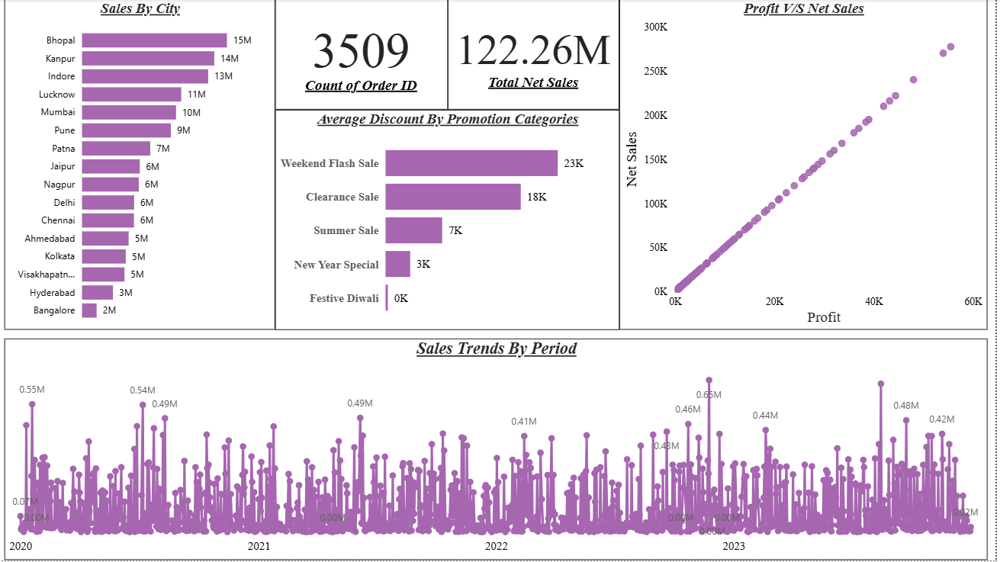
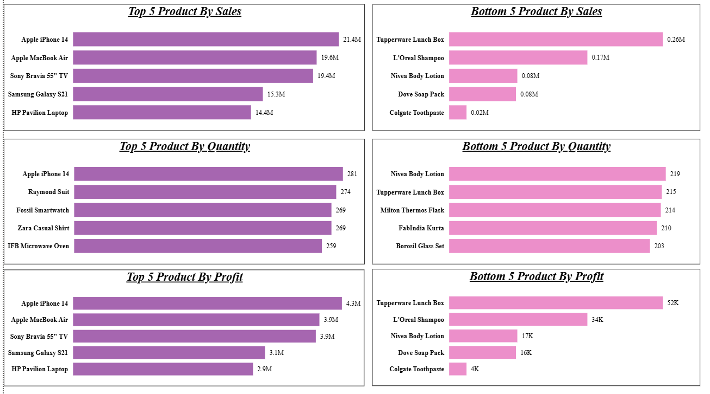
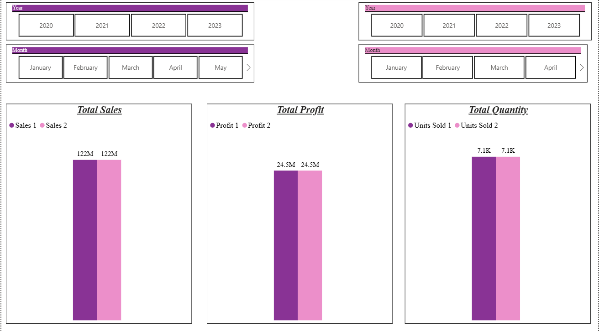
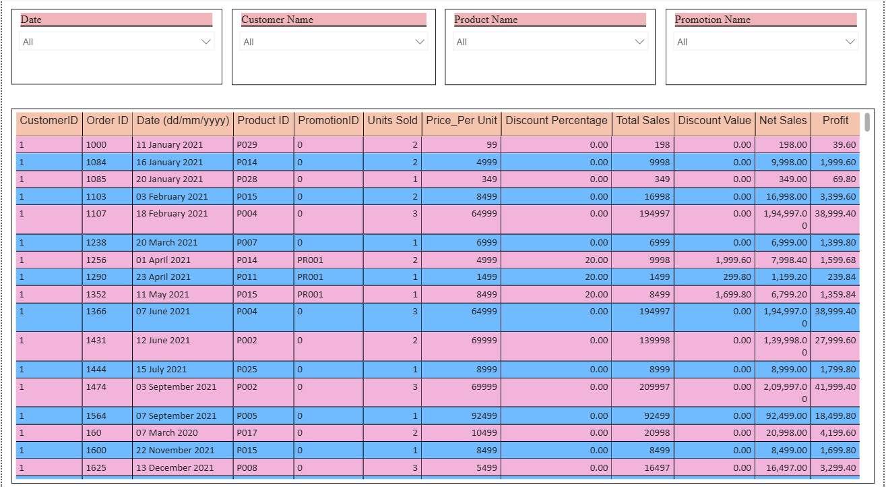

# 📊 ElectroHub Sales Performance Dashboard

An interactive Power BI dashboard built to analyze ElectroHub's sales performance across products, promotions, cities, and time periods—focusing on profitability, sales trends, product performance, and order-level insights.

---

# 📌 Short Description / Purpose

The **ElectroHub Sales Dashboard** is an interactive Power BI report designed to provide comprehensive insights into the company's sales operations from 2020 to 2023. The dashboard helps business stakeholders monitor sales and profit trends, evaluate promotional effectiveness, analyze top and bottom performing products, and explore detailed order-level information to support data-driven decision-making.

---

# 🛠 Tech Stack

The dashboard was built using the following tools and technologies:

* 📊 **Power BI Desktop** – Main data visualization platform used for report creation.
* 📂 **Power Query** – Data cleaning and transformation layer for preparing the dataset.
* 🧠 **DAX (Data Analysis Expressions)** – Used for calculated measures and KPIs.
* 🔗 **Data Modeling** – Relationships established between tables to enable filtering and aggregation.
* 📋 **Matrix Visuals** – Used for detailed order-level analysis.
* 📁 **File Format** – `.pbix` for development and `.png` for dashboard previews.

---

# 📂 Data Source

**Source:** Internal sales transaction dataset for ElectroHub.

The dataset contains information related to:

* Dim Customers
* Dim Product
* Dim Promotion
* Fact Table

The data spans from **2020 to 2023** and supports both high-level KPI reporting and granular order-level analysis.

---

# ⭐ Features / Highlights

## Business Problem

ElectroHub generates thousands of orders across multiple cities and product categories. However, raw transactional data makes it difficult to answer important business questions such as:

* Which products generate the highest sales and profits?
* Which products are underperforming?
* How do sales and profits change over time?
* Which promotions offer the highest discounts?
* Which cities contribute the most revenue?
* How many orders have been placed overall?
* What is the relationship between sales and profitability?

Without an interactive reporting solution, these insights are difficult to obtain efficiently.

---

## Goal of the Dashboard

The dashboard was designed to:

* Monitor overall business performance.
* Track sales, profit, and quantity sold over time.
* Identify top and bottom performing products.
* Analyze promotion categories and discount patterns.
* Compare performance between different periods.
* Explore detailed order-level information through interactive filters.
* Support better business decisions through data visualization.

---

# 📈 Walkthrough of Key Visuals

## KPI Cards

The dashboard provides key business metrics:

* **Total Sales:** 122M
* **Total Profit:** 24.5M
* **Total Units Sold:** 7.1K
* **Total Orders:** 3,509

---

## Sales Trend Analysis

Line charts are used to analyze sales performance across different periods including daily, monthly, quarterly, and yearly trends.

### Year-wise Performance

| Year | Sales | Profit | Units Sold |
| ---- | ----: | -----: | ---------: |
| 2020 | 31.4M |   6.3M |      1,777 |
| 2021 | 30.0M |   6.0M |      1,692 |
| 2022 | 28.6M |   5.7M |      1,741 |
| 2023 | 32.3M |   6.5M |      1,913 |

---

## Product Performance Analysis

Top and Bottom 5 products are analyzed based on:

* Sales
* Profit
* Quantity Sold

### Key Findings

✔ **Apple iPhone 14** generated the highest sales, profit, and quantity sold.

✔ **Tupperware Lunch Box** recorded the lowest sales and profit.

✔ **Nivea Body Lotion** had the lowest quantity sold.

---

## Profit vs Sales Analysis

A scatter chart visualizes the relationship between sales and profit, helping identify highly profitable products and understand performance patterns.

---

## Promotion Category Analysis

Average discounts are analyzed across promotion categories.

### Key Finding

✔ **Weekend Flash Sales** offered the highest average discount among all promotion categories.

---

## Sales by City

Bar charts provide city-wise sales analysis.

### Top 3 Cities by Sales

| City   | Sales |
| ------ | ----: |
| Bhopal |   15M |
| Kanpur |   14M |
| Indore |   13M |

---

## Order-Level Analysis

A **Matrix Visual** provides detailed transactional information and allows users to filter records by:

* Product
* Date
* Customer ID
* Promotion Categories

Metrics displayed include:

* Sales
* Profit
* Discount
* Net Sales
* Order details

---

# 💡 Business Impact & Insights

### Product Insights

* Apple iPhone 14 emerged as the strongest product across all major metrics.
* Tupperware Lunch Box showed the weakest sales and profit performance.
* Nivea Body Lotion recorded the lowest quantity sold.

### Promotion Insights

* Weekend Flash Sales provided the highest average discounts, indicating aggressive promotional strategies.

### Regional Insights

* Bhopal, Kanpur, and Indore contributed the highest sales among all cities.

### Trend Insights

* Sales and profit declined slightly during 2021 and 2022 before recovering in 2023.
* 2023 recorded the highest sales, profit, and quantity sold among all four years.

### Profit vs Net Sales Analysis:
A scatter chart reveals a strong positive relationship between Profit and Net Sales, showing that higher sales consistently generate higher profits. The close clustering of data points indicates stable profit margins and overall healthy business performance.

---

# 📸 Dashboard Preview

### Overview Dashboard

### Top/Bottom 5 Product

### Comparsion of Sales, Profit and Quantity

### Table Visual

---
